# DRON — User Flows

**Status:** Draft · June 2026. Mermaid `flowchart TD` per job. Renders on GitHub.
**Source of truth:** every screen node here exists in [`sitemap.md`](sitemap.md) `§6 Screens`.
Jobs reference [`research/jtbd.md`](research/jtbd.md). Two personas kept separate — **Client** and **Operator**.

**Legend**
- `[" screen "]` — a screen (name taken from `sitemap.md`).
- `{" question? "}` — a decision, branched `-->|yes|` / `-->|no|` (or named branches).
- Stadium `([" … "])` — a **state**: `Loading`, `Empty`, `Error`, or a terminal.
  Amber = state, red = dead-end (person stuck), green = success.
- States are nodes, not happy-path only: every flow shows `empty` / `error` / `loading` and **both ends** — success and dead-ends.

---
---

# SHARED — entry

## ROLE FORK — Client or Operator (after registration, then onboarding)

> After registering with Diia / BankID for the first time, the person must declare which side they are on — **get a service done** (Client) or **provide services** (Operator) — before any persona-specific screen. Right after the fork each side runs a short **onboarding**, then enters its path. One-time; returning, already-classified users skip straight to their side. — `sitemap.md §6.0`

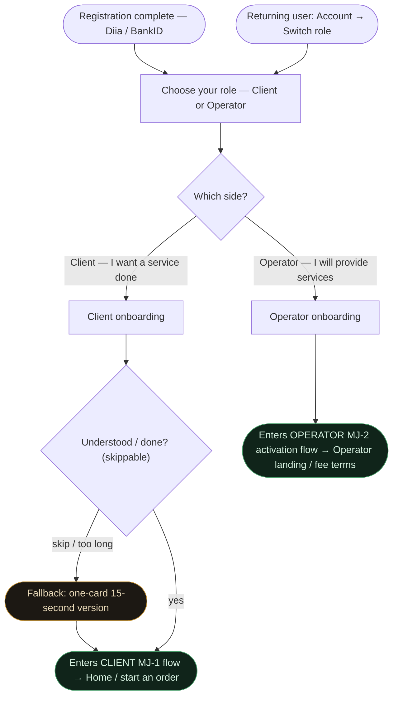

**Decisions**
- *Which side?* — the single classification that routes the whole product; no browsing, no mixing (`sitemap.md §6.0`).
- *Understood / done?* — Client onboarding carries the `EJ-1` explainer; if skipped it collapses to a one-card version (never a dead-end).

**States & dead-ends**
- The fork itself is a stateless local choice — two fixed options, resolves instantly, no dead-end: both branches run an onboarding, then a persona main flow.
- *Client onboarding* has one real state — `Empty` (skipped / too long) → one-card fallback. *Operator onboarding* is a stateless lead-in to the activation gate.

---

## CHANGE PERSONA — switch Client ⇄ Operator (any time, from Account)

> A person is not locked to their first choice. From **Account** on either side (`sitemap.md §7.4`, Deep) they can re-enter the role fork and switch — a client who becomes an operator, or an operator ordering a service as a client. This entry exists in **every** flow via the persistent Account utility.

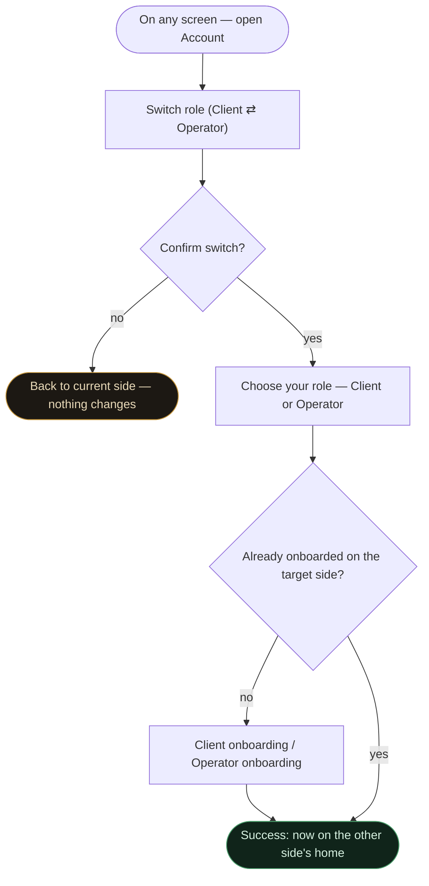

**Decisions**
- *Confirm switch?* — a deliberate confirm so a mis-tap doesn't drop an in-progress order/job; decline returns unchanged.
- *Already onboarded on the target side?* — first-ever switch runs that side's onboarding once; thereafter it goes straight to home.

**States & dead-ends**
- `State` — declined switch → back to the current side, no change.
- `Success` — landed on the other side's home. No dead-end: switching is always reversible from the same Account entry.

---
---

# CLIENT

## MAIN JOB · MJ-1 — Order a service quickly and reliably

> **When** I need a result only a drone can deliver, **I want** to hand the job to a certified professional without managing anything, **so that** I get the outcome without thinking about the drone or the operator. — `jtbd.md` MJ-1

 **Long way** — this diagram shows the logical 5-screen path; navigation (`sitemap.md §7.3`) merges *Service catalogue* into *Home* and *Order review & price* into *Order setup* to hit the 3-tap target. Depth deliberately not re-cut here.

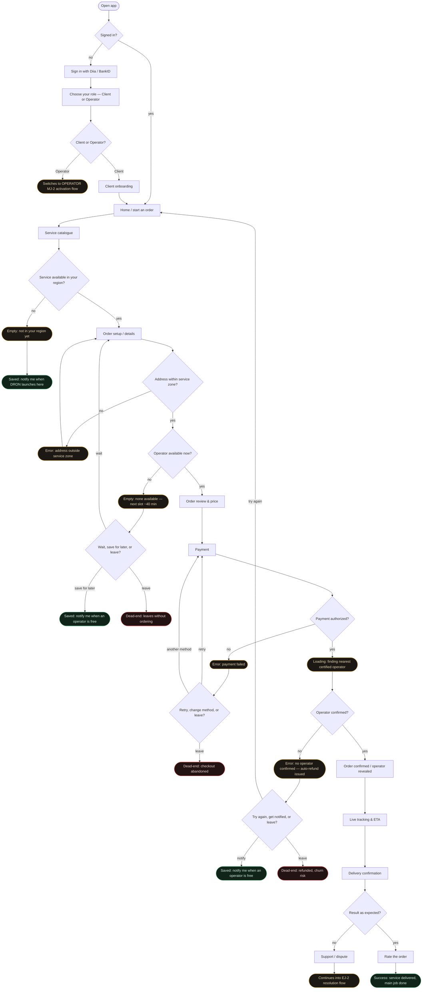

**Decisions**
- *Signed in?* — no → one-tap Diia / BankID (`C-02`); yes → straight to Home.
- *Client or Operator?* — first-time only, straight after registration (`sitemap.md §6.0`), then **Client onboarding** before Home; returning clients skip both. Choosing Operator leaves this flow for the operator side. Persona is switchable later from **Account → Switch role** (`sitemap.md §7.4`; see *CHANGE PERSONA* flow above).
- *Service available in your region? / Address within service zone?* — coverage gates (geography rollout UA + EU).
- *Operator available now?* — availability shown before payment (`C-01`).
- *Payment authorized?* — Apple/Google Pay outcome (`C-04`); on failure, retry or switch method.
- *Operator confirmed?* — auto-dispatch result after payment (`MJ-1`, Bolt model M-1).
- *Result as expected?* — branches into the dispute job (`EJ-2`).

**States & dead-ends**
- `Empty` — not in your region yet → **notify when launched (saved, not churn)**.
- `Error` — address outside service zone → fix address.
- `Empty` — none available now → wait, **save for later (notify)**, or leave (dead-end).
- `Error` — payment failed → retry / change method / leave.
- `Loading` — auto-dispatch searching for an operator.
- `Error` — no operator confirmed → auto-refund → try again / **notify** / leave.
- `Success` — delivered + rated; the *Saved* recovery turns a stock-out into a lead, not a loss.
- *Hand-off* — the dispute path continues into the **EJ-2 resolution flow** (below).

---

## RELATED · RJ-C1 — Confirm the person coming is real and qualified

> **When** I've found a service but never used drone services, **I want** to see proof of who will come, **so that** I commit without lingering doubt. — `jtbd.md` RJ-C1

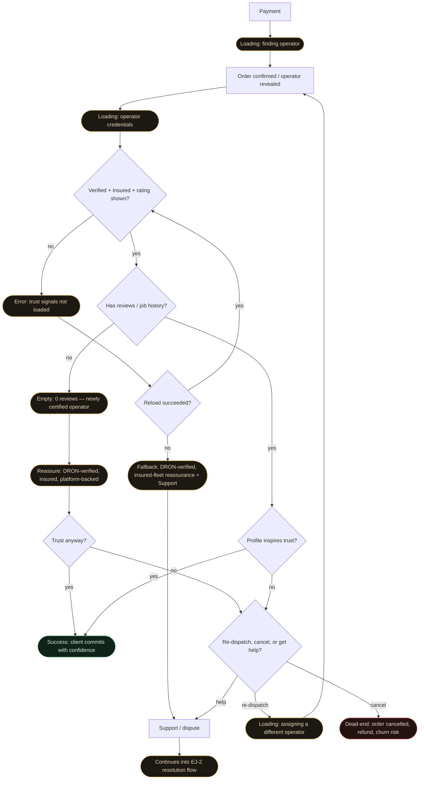

**Decisions**
- *Verified + Insured + rating shown?* — the no-tap trust signals (M-2); loaded, retried, or fallback reassurance.
- *Has reviews / job history?* — separates experienced (O-1) from cold-start (O-2); 0 reviews → platform reassurance.
- *Trust anyway? / Profile inspires trust?* — the commit decision.
- *Re-dispatch, cancel, or get help?* — re-dispatch a different operator is offered before cancel.

**States & dead-ends**
- `Loading` — finding operator; loading credentials.
- `Error` — trust signals not loaded → reload → fallback reassurance + Support (no more app-close).
- `Empty` — 0 reviews → platform-backed reassurance, then the trust decision.
- `Success` — client commits with confidence.
- **Dead-end** — only a deliberate cancel → refund → churn; help → **EJ-2 resolution flow** (below).

---

## RELATED · RJ-C2 — Eliminate the unknown between payment and arrival

> **When** I've paid and the money has left my account, **I want** to know who is coming, when, and where they are now, **so that** the gap doesn't feel like a void. — `jtbd.md` RJ-C2

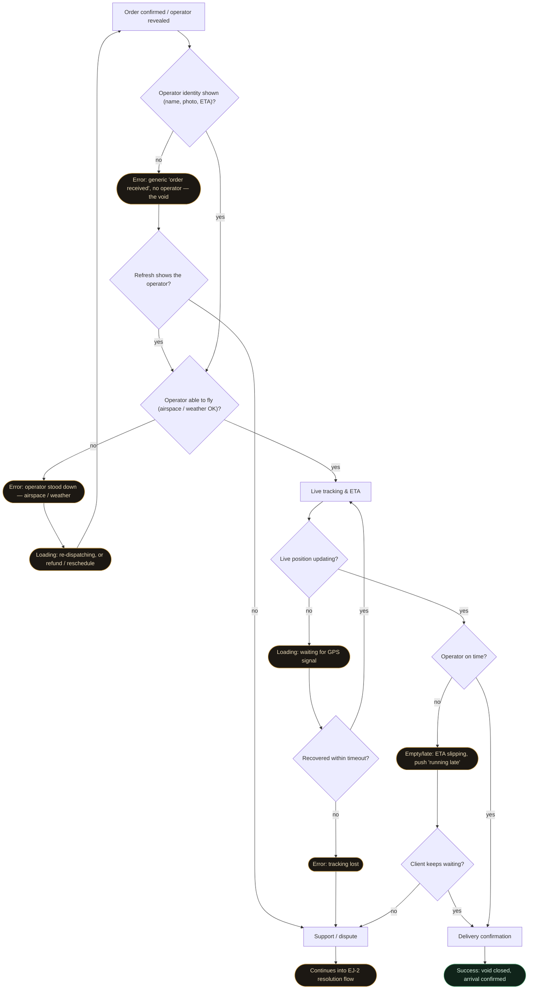

**Decisions**
- *Operator identity shown?* — named human vs generic "order received"; refresh, else Support.
- *Operator able to fly (airspace / weather)?* — wartime airspace / weather abort → re-dispatch or refund (`research.md` Finding 1/4).
- *Live position updating? / Recovered within timeout?* — tracking health.
- *Operator on time? / Keeps waiting?* — delay tolerance (`N-9` unknown).

**States & dead-ends**
- `Error` — the void → refresh → Support (no dead-end).
- `Error` — operator stood down (airspace/weather) → `Loading` re-dispatch / refund.
- `Loading` — waiting for GPS; `Error` — tracking lost → Support.
- `Empty/late` — ETA slipping → wait or escalate.
- `Success` — arrival confirmed; escalation → **EJ-2 resolution flow** (below).

---

## RELATED · RJ-C5 — Repeat without starting over

> **When** I want the same service again, **I want** to get back to "confirmed" in a single action, **so that** the second time is easier than the first. — `jtbd.md` RJ-C5

 **Long way** — the *Book again* path should be 2 taps (`sitemap.md §7.3`); the longer Home → history → setup branch below is the no-shortcut fallback, not the target.

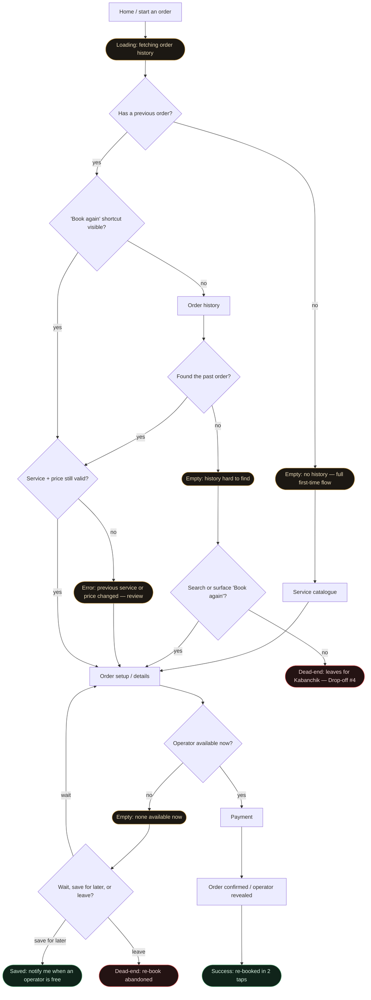

**Decisions**
- *Has a previous order?* — returning vs first-time.
- *'Book again' shortcut visible?* — the one-tap path (`C-07`).
- *Found the past order? / Search?* — buried history now offers search, not instant churn.
- *Service + price still valid?* — stale re-book caught before payment.
- *Available? / Wait, save, or leave?* — stock-out offers a saved-lead recovery.

**States & dead-ends**
- `Loading` — fetching history.
- `Empty` — no history → full MJ-1 flow; buried → **search / surface Book again** before any dead-end.
- `Error` — previous service or price changed → review before paying.
- `Empty` — none available → wait, **save for later (notify)**, or leave (dead-end).
- `Success` — re-booked.

---

## RELATED · EJ-2 — Resolution after a bad experience (scoped June 2026)

> **When** the result doesn't match what I expected, **I want** a clear path to resolution — not just a rating I can leave, **so that** one bad experience doesn't become a reason to never come back. — `jtbd.md` EJ-2

**Why this flow exists.** `jtbd.md` flags EJ-2 as a score-3 job for C-1 with **no function defined** —
the gap the other client flows previously dead-ended into. This scopes it, reusing the benchmarks
already cited in `jtbd.md` Table 2: **Glovo** no-questions refund, **Bolt** re-dispatch / safety,
**Airbnb** 24/7 support. Entry points are the hand-offs from MJ-1 (result not as expected),
RJ-C1 (trust concern / cancel) and RJ-C2 (no-show / tracking lost).

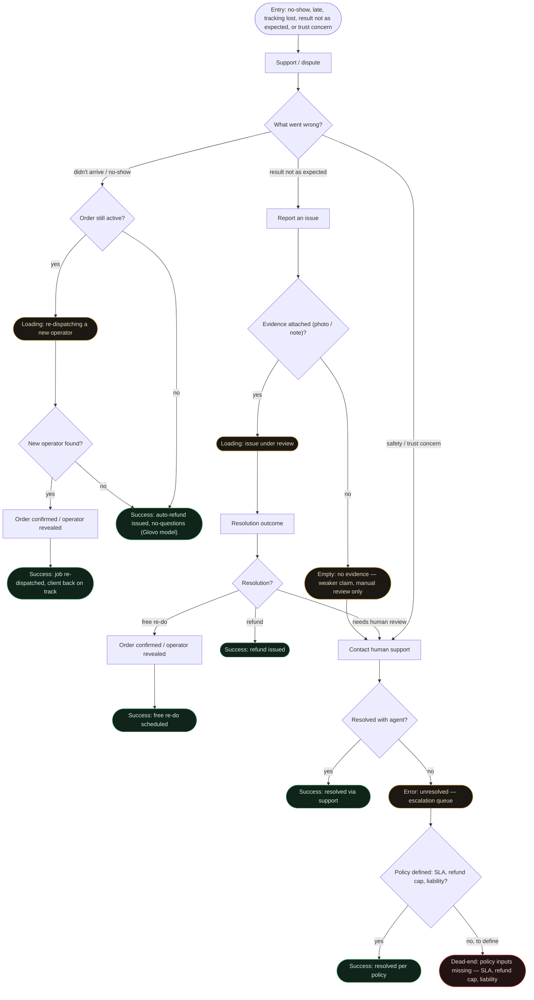

**Decisions**
- *What went wrong?* — routes to the right remedy: delivery failure vs quality vs safety.
- *Order still active? / New operator found?* — re-dispatch vs refund (Bolt / Glovo).
- *Evidence attached?* — strength of a quality claim.
- *Resolution?* — refund / free re-do / human review.
- *Resolved with agent? / Policy defined?* — escalation outcome (Airbnb 24/7).

**States & dead-ends**
- `Loading` — re-dispatching a new operator; issue under review.
- `Empty` — no evidence → manual review only.
- `Error` — unresolved with agent → escalation queue.
- `Success` (multiple real ends) — re-dispatched · auto-refund · free re-do · resolved via support · resolved per policy.
- **Dead-end (the only one left)** — reached *only* when policy inputs are still undefined: SLA, refund cap, and third-party liability amount `[?]` (liability blocked on legal verification — `research/research.md` Finding 4). Everything upstream now resolves; this is the single honest gap remaining.

---

## RELATED · EJ-1 — First use feels safe

> **When** I consider a drone service for the first time, **I want** to feel that someone accountable is coming, **so that** "a stranger with a drone" stops feeling like a risk I take alone. — `jtbd.md` EJ-1

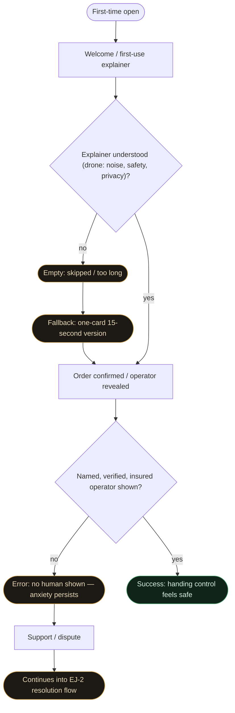

**Decisions**
- *Explainer understood?* — the H-4 15-second explainer; if skipped, a one-card fallback.
- *Named, verified, insured operator shown?* — Bolt-model human reveal (D-3).

**States & dead-ends**
- `Empty` — explainer skipped → short fallback.
- `Error` — no human shown → Support → **EJ-2 resolution flow**.
- `Success` — first use feels safe.

---

## RELATED · RJ-C4 — Receive proof that the job was done

> **When** the operator has finished, **I want** a clear, documented result, **so that** I have evidence I can use, share or act on. — `jtbd.md` RJ-C4

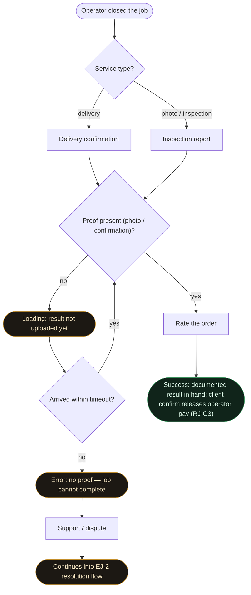

**Decisions**
- *Service type?* — delivery confirmation vs inspection report (C-2).
- *Proof present? / Arrived within timeout?* — proof gates completion (H-7) and the operator payout (`RJ-O3`).

**States & dead-ends**
- `Loading` — result not uploaded yet.
- `Error` — no proof → Support → **EJ-2 resolution flow**.
- `Success` — documented result; the client confirm here is what releases the operator's payment.

---

## RELATED · SJ-1 — Be the one who introduced something new

> **When** the service works the way it should, **I want** to share it in a single action, **so that** I'm the one who showed people something new. — `jtbd.md` SJ-1

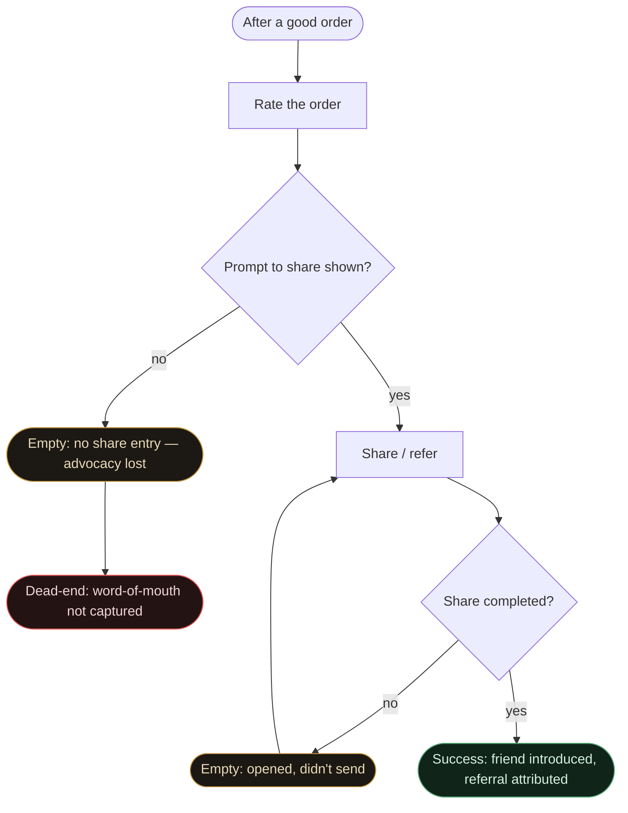

**Decisions**
- *Prompt to share shown?* — a missing share entry is the silent advocacy leak.
- *Share completed?* — opened vs sent.

**States & dead-ends**
- `Empty` — no share entry → **word-of-mouth not captured (dead-end — fix: always offer a one-tap share)**.
- `Empty` — opened but didn't send → back to Share.
- `Success` — referral attributed.

---
---

# OPERATOR

## MAIN JOB · MJ-2 + RJ-O3 — Take the order, fulfil it, get paid, withdraw

> **When** I have the licence, equipment and capacity, **I want** pre-qualified jobs to reach me and payment to move on its own, **so that** I spend my time flying, not selling or chasing money. — `jtbd.md` MJ-2, RJ-O1, RJ-O2, RJ-O3

**Model (Bolt / Uklon driver cash-out).** Two phases. **Phase A — fulfil the order first:** earnings from each completed order land in the operator's balance. Balance accrues across orders. **Phase B — withdraw is the LAST step:** only from an accumulated balance does the operator cash out — instant to a linked card, or bank transfer in 1-3 days. No per-order withdrawal.

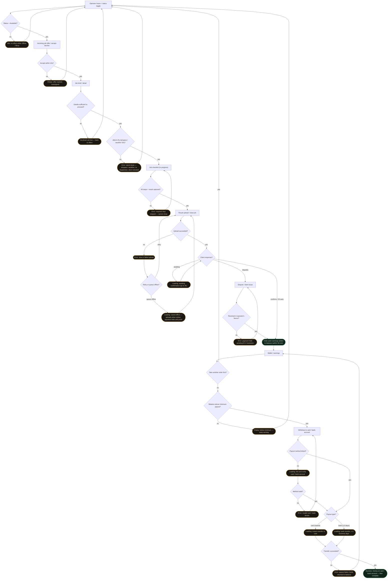

**Decisions**
- *Status = Available?* — gates dispatch (`O-02`). The operator can also **Switch role → Client** from Account at any time (`sitemap.md §7.4`; *CHANGE PERSONA* flow above) — e.g. to order a service as a client.
- *Accept within 10s?* — lock-screen decision (`RJ-O1`, `O-01`); declining loops back to offers, not a dead-end.
- *Able to fly (airspace / weather)?* — wartime/weather abort → re-dispatch + client refund (`research.md` Finding 1/4).
- *All steps captured? / Upload succeeded?* — execution gates; a failed upload **queues offline**, never closes without proof.
- *Client response?* — confirm / 2h auto-confirm / **dispute** (operator-side EJ-2, payment held).
- *Balance above minimum? / Method linked? / Payout type? / Transfer succeeded?* — the withdrawal tail, the last step.

**States & dead-ends**
- `Idle` — no offers while Offline/Busy.
- `Empty` — offer expired → reassigned; declined → back to offers; balance below minimum → keep earning.
- `Error` — airspace/weather stand-down → re-dispatch; step skipped → back to checklist.
- `Loading` — upload queued offline (payment held until proof); awaiting confirmation; linking method; transfers.
- `Error` — client dispute → payment held pending EJ-2; invalid payout details → fix; payout failed → funds returned to balance.
- `Success` — order paid into balance; or money withdrawn (flow complete). **No dead-ends remain in this flow.**

---

## RELATED · MJ-2 (activation) — Join and get verified

> **When** I have the licence and equipment, **I want** to get verified and live without silence, **so that** I can start receiving jobs. — `jtbd.md` MJ-2; CJM Operator Stage 2, Drop-off #3

Reached from the **role fork** (`§SHARED`) → **Operator onboarding** → the activation gate below. Persona is switchable any time from **Account → Switch role** (`sitemap.md §7.4`; *CHANGE PERSONA* flow above).

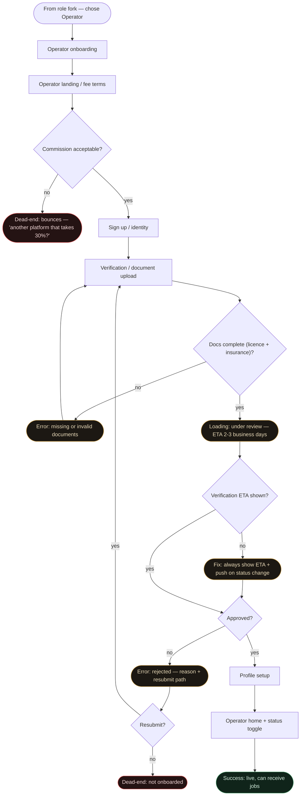

**Decisions**
- *Commission acceptable?* — fee shown before signup (`OE-12`).
- *Docs complete?* — licence + insurance upload.
- *Verification ETA shown?* — if missing, the fix is to **always show ETA + push** (removes the silence drop-off), not a dead-end.
- *Approved? / Resubmit?* — review outcome; rejection always carries a reason + resubmit path.

**States & dead-ends**
- `Error` — missing/invalid docs → re-upload; rejected → reason + resubmit.
- `Loading` — under review (ETA 2-3 days).
- *Fix* — the no-ETA branch routes to "always show ETA", closing Drop-off #3.
- **Dead-end (legit)** — operator rejects the fee, or declines to resubmit; both are real choices, not product holes.
- `Success` — live and dispatchable.

---

## RELATED · EJ-3 — Build a reputation worth having

> **When** I complete jobs and get rated, **I want** to see what clients valued and what they didn't, **so that** my effort turns into something I can grow. — `jtbd.md` EJ-3

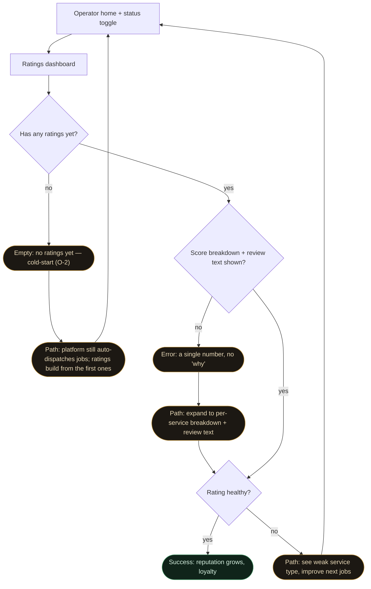

**Decisions**
- *Has any ratings yet?* — cold-start (O-2) vs established (O-1); cold-start still gets auto-dispatched work.
- *Score breakdown + review text shown?* — transparency that drives loyalty (`O-06`).
- *Rating healthy?* — grow vs improve loop.

**States & dead-ends**
- `Empty` — no ratings yet → **auto-dispatch keeps feeding jobs; ratings accrue** (no cold-start dead-end).
- `Error` — only a number → **expand to breakdown + review text** (no frustration dead-end).
- `Success` — reputation grows; feedback loop back to more jobs.
